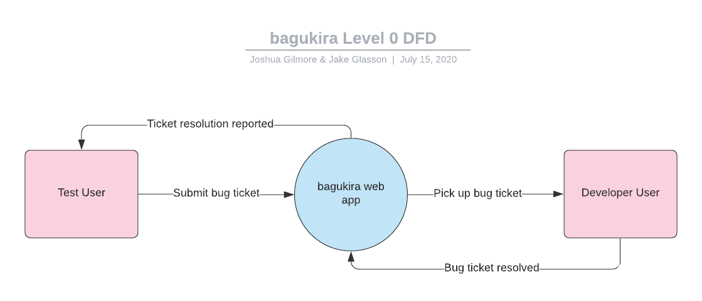
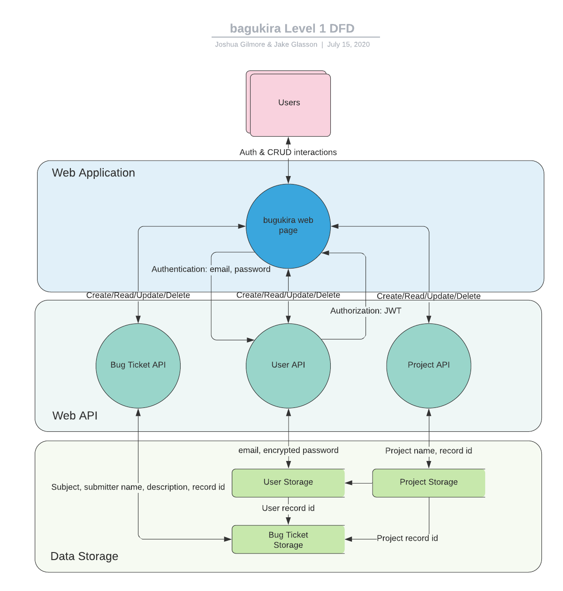
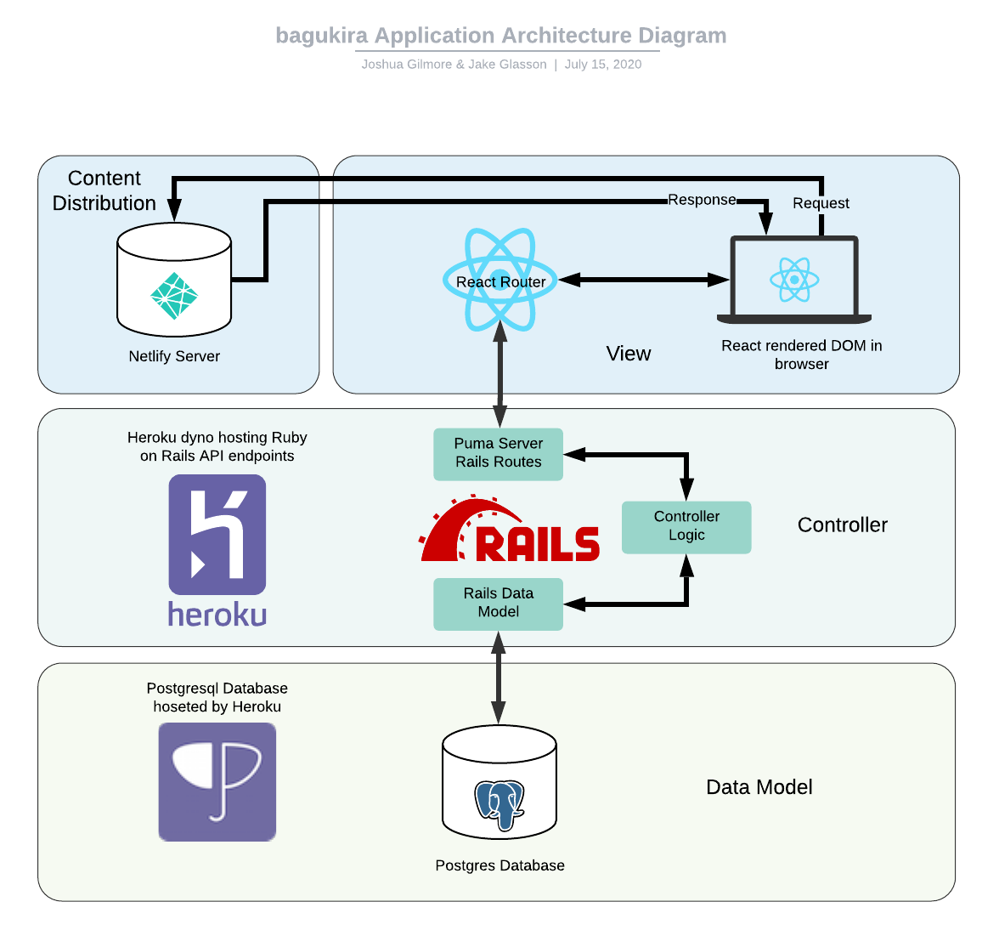
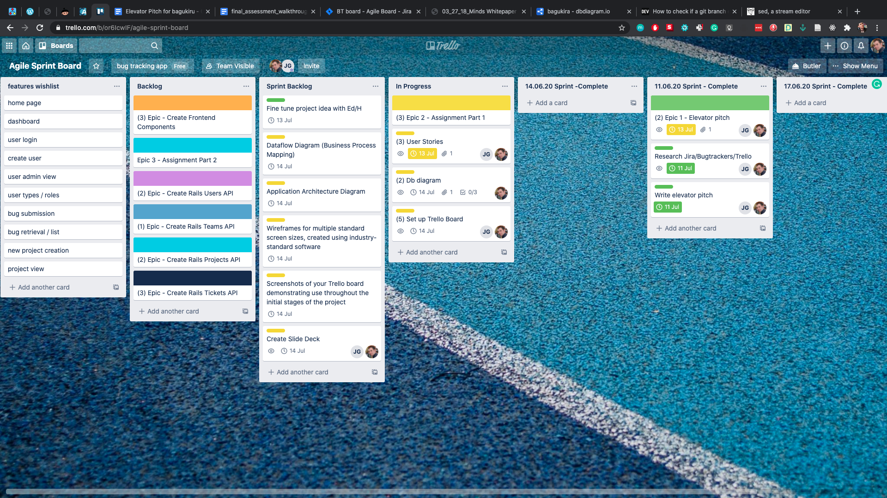
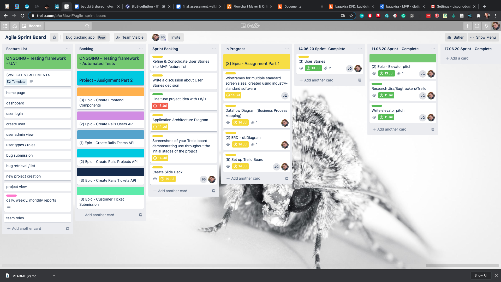
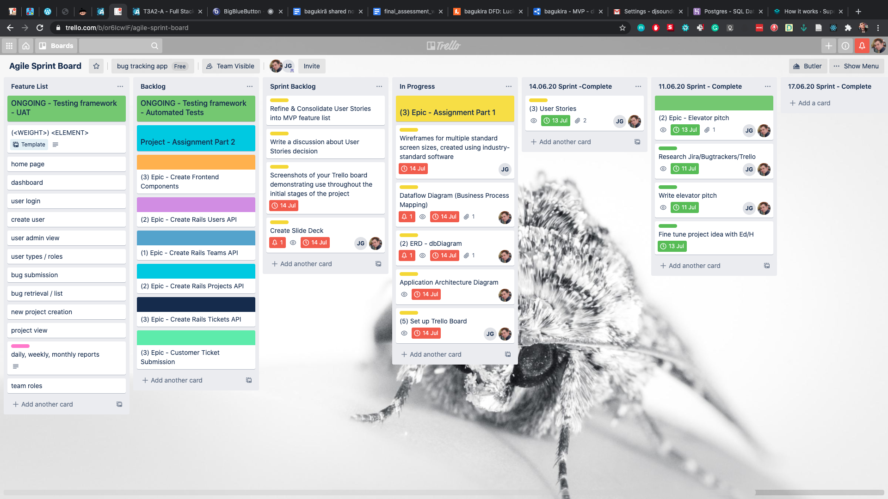
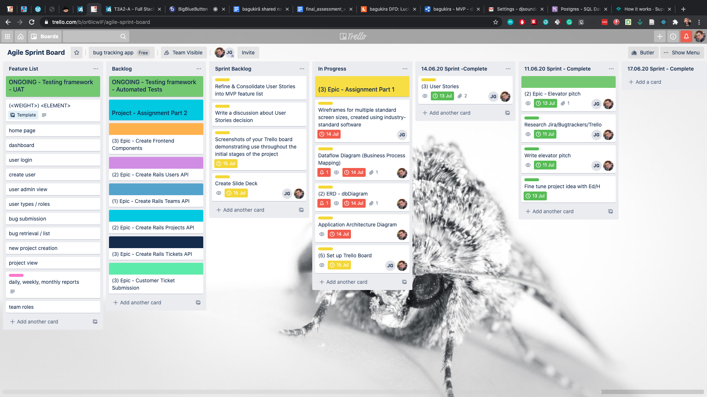
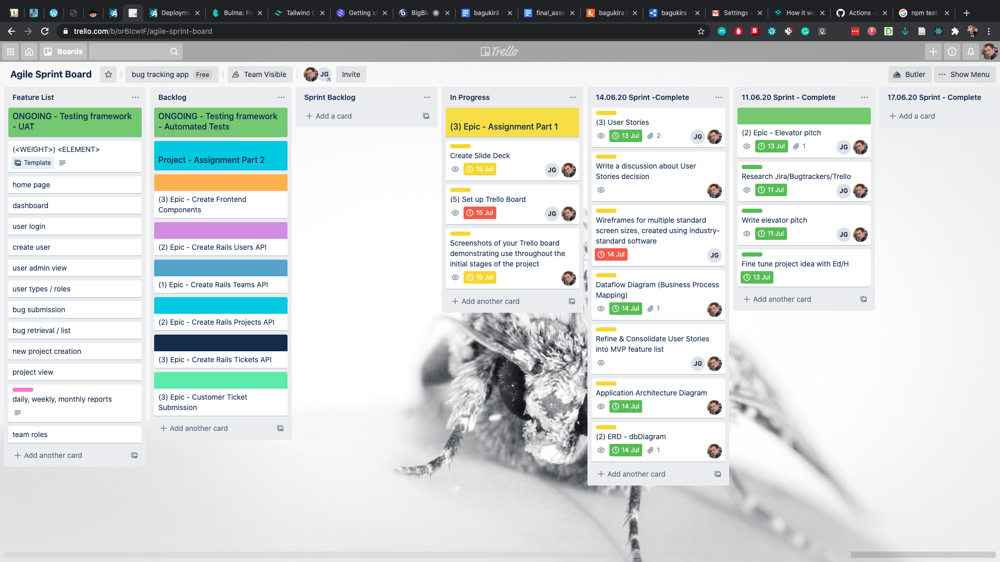
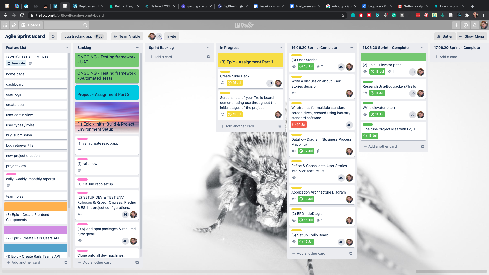

# R1 Website Description:

## Purpose:
To build a web application that can be used to report bugs from manual testing and discovery within an organisational context, and record the progress of bug fixes applied. We want to create something we could actually use ourselves to track issues we come across even in the creation of this project itself.

Some ticketing systems are quite extensive and can take a while to learn, they also require login credentials for all users. We wanted a way that someone could report a bug without potentially being put off by having to go through a registration process first.

We gave some thought to agile work processes and whether this app could be built to incorporate agile workflows. Following discussions about the scope we settled on a minimum scope implementation that would achieve the ends of reporting and tracking within the context of project units/groups/.

## Functionality/ features:

We created an extensive list of user story epics in our ideation and research process. In order to meet the requirements of the project by deadline we have made decisions about what we considered the true Minimum Viable Product for an application of this kind. Some exclusions were hotly debated as they present potential problems with technical debt if the application is to be extended beyond MVP. 

We also discussed possible database integrity problems around cardinality and legacy compatibility issues the MVP feature set may create.

Ultimately we have created a plan for a minimalist application which will deliver the basic requirements of a bug tracker that we are confident to deliver before the deadline given the level of technical ability available in our team. 

If we are able to hit this hurdle with time to spare we intend to extend functionality further following the feature list deliverables outlined in the *Future Pipeline* section that follows our MVP feature list below.

## Minimum Viable Product Deliverable:

### Shared (Unprotected):

#### Component Library:

Views:

- Login
- Register

App:

- Logo
- Page title
- Heading
- Favicon

Component Module:

- Email input
- Password Input
- Confirm Password Input
- Name Input
- Description Input
- Save (Submit) button
- Table (bug list)
- Table row (bug summary)
- Sidebar
- Sidebar heading
- Sidebar link

Navigation bar with links (display only those available to given permission set) / Navigation hamburger menu:

- Sign Out link
- All Projects link

Sign In / Sign Up Card:

- Sign In button (inherit from shared Submit button)
- Sign Up button (inherit from shared Submit button)
- Email Input (shared component)
- Password Input (shared component)
- Confirm Password Input (shared component)

Features:

- System overview dashboard should be able to drill down into project and ticket views
- Can see how many bugs are open, in progress and closed

#### Bug Tickets:

View:

- Sidebar
- Index
- Edit / Submit New

Components:

- Sidebar links (Bug List, New Bug)

Fields:

- Status (pending, in progress, completed)
- Subject
- Submitted by (name)
- Description

Ability:

- Create
- Read
- Update

Features:

- user can input information on the bug ticket about what they were doing / attempting to do at the time (modify description)
- can see who submitted a bug
- can see who's assigned to a bug
- ability to change ticket status
- can mark a bug as fixed
- can see how long a bug has been open
- can provide information on how he fixed a bug
- can re-open bug tickets

#### Projects:
View:

- Index
- Project card (web & phone)

Ability:

- Read

#### Project Manager ONLY (Protected):

All shared elements + Ability (project manager permission set)

#### Users:

View:

- Navbar link: add users
- Add users form

Fields:

- email list
- send button (inherit from shared Submit button)

Action:

- send email invite to email list (Devs & Testers)

#### Projects:

Views:

- new/edit

Fields:

- Name
- Save button (shared component)

Ability:

- create
- update
- delete

#### Bug Tickets:

View:

- delete button

Components:
- Sidebar links (Add User, Edit Project)

Ability:

- delete

### Future Pipeline (stretch targets):

#### Views:

- User index
- Team index
- User detail (self)
- Project detail
- Team detail
- User edit
- Team edit view
- Graphs for reviewing progress and open tickets.
- Count queries for: tickets, projects, users. With status breakdown

#### Users:

- User type (determines access permissions)
- User first name
- User last name
- ticket workload maximum (based on sum of allocated tickets weight and priority, avoids overload by auto allocation)
- has many teams
- has many projects
- can has many tickets
- has many managers

####  Teams:

- Team name
- Team members index
- Team projects index

####  Tickets:

- Ticket weighting (story points equivalent)
- Priority
- bug archive
- sorting by header

####  Processes/Helpers:

- Ticket allocation/balancing
- Notification of ticket/bug status change
- One click status change button (i.e. change from “in progress” to “completed”)
- BUMP old ticket (can be disabled on per ticket or per project basis)
- Request assistance on ticket
- Request ticket reassignment

#### Email:

- receive incoming bugs?
- send ticket status notifications and new note entries?
- send new unassigned ticket notification to admin or project lead
- Unsubscribe (opt out of email notifications per user preference)

#### Owner/Subscriber Account:

- able to manage their bagukirā software subscription and payment credentials.

#### Admin:

- admin permission set (manage: users, projects, teams)
- project index (all organisations/companies)
- ability to create, read, update & delete projects
- ability to create, read, update & delete users (testers, project managers, developers, admins)
- ability to assign users to teams and projects
- ability to reassign tickets to developers, many can be allocated to one ticket
- ability to change tester who owns ticket retain originally submitted by (change history)
- ability to receive notifications
- dashboard view: activity/progress visualisation for: user/subordinate, teams, projects, tickets.
- Project & Team creation final approval.

#### Project Manager/Team Lead:

- can create new teams (optional admin approval workflow)
- can create developer and tester accounts and add them to her projects
- can see individual stats on testers and devs such as: bugs submitted, bugs fixed, amount of bugs assigned
- can assign bugs to specific teams / people
- receive daily, weekly and monthly reports on app metrics
- ability to assign/reassign bugs, to more than one developer
- ability to receive notifications
- ability to assign users to projects and teams
- dashboard view: activity/progress visualisation for: user/subordinate, teams, projects, tickets. 

#### Developer:

- developer permission set
- notification system when a new bug is submitted that he can fix (front end, back end, both)
- access to information on all the bugs that exists, what section they belong to
- the ability to assign bugs to his account
- has access to information on the bug: time encountered, when it was submitted, who submitted it, how to reproduce it, time open
- ability to send and receive notifications about new tickets or notes added to tickets picked up by or allocated to them
- dashboard view: activity/progress visualisation for: teams, projects, tickets.

#### Tester:

- tester permission set
- backlog of submitted bug tickets relevant to the tester who submitted them
- bug tickets track who submitted them
- questions and answer section on tickets for devs to interact with testers
- user can input the time the bug occurred (different to the time the bug was submitted)
- If the tester can reproduce the bug, they can provide information on the ticket for how to repeat it
- tester can submit misc. comments on the bug ticket
- tester can submit bug ticket with needed information into database
- ability to receive and send notifications about tickets submitted by them
- dashboard view: activity/progress visualisation for: projects, tickets

### Target Audience:

Bagukira is a web application designed for companies to use as an internal tool in the development of software. The target audience for this application are the project managers, developers and testers of these companies in charge of bringing the software to production. Bagukira offers a platform for which these users can track and manage bugs related to the software they are building.

### Tech Stack

The tech stack that Bagukira is built on is as follows:

#### Frontend
##### Languages
- HTML
- CSS
- JavaScript (ES6)

##### Frameworks
- React
- Bootstrap

#### Backend
##### Languages
- Ruby

##### API Framework
- Ruby on Rails

##### API Web Server
- Puma

##### Database
- PostgreSQL

#### Tools/NPM Packages/Ruby Gems
#####
- styled-components
We will decide on additional appropriate gems and packages if need arises as we progress

##### Package/Gem management
- Bundler
- Webpack
- npm
- Ruby gems

##### Testing
- Rspec
- Shoulda Matchers
- Jest
- Cypress and probably DOM Testing Library
- Will trial GitHub Actions (Integration Testing)

##### Mocking
- factory_bot_rails
- Postman

##### Source & Version Control
- git
- GitHub

##### Deployment:
Our React frontend is hosted on Netflify as a static page, the backend Rails API and Postgres Database is hosted on Heroku.
## R2 Data Flow Diagram

## R3 Application Architecture Diagram

## R4 User Stories:

### Tester - James

James is a tester, a part of the quality assurance team of a large software product being developed by Evil Corp. James has been given the task to test the software and note all the bugs that he finds.

James needs to be able to identify the bug and give detailed information on it such as: when the bug occurred, what he was doing or attempting to do at the time, if possible give instructions on how to repeat the bug, miscellaneous comments relating to the bug and log this information into some sort of system that can track all the bugs he finds. 

Because James is not the only tester in the QA team, any bugs he submits will have his name on them so that if need be he can answer questions the dev team may have about the bug.

James also wants to be able to have a backlog specific to the bugs he's submitted so that if need be he can retest for those bugs when they've been marked as fixed.

#### Stories

- login system for testers
- backlog of submitted bug tickets relevant to the tester who submitted them
- bug tickets have a status: open, in progress, fixed
- bug tickets track who submitted them
- questions and answer section on tickets for devs to interact with testers
- user can input the time the bug occurred (different to the time the bug was submitted)
- user can input information on the bug ticket about what they were doing / attempting to do at the time
- If the tester can reproduce the bug, they can provide information on the ticket for how to repeat it
- tester can submit misc. comments on the bug ticket
- tester can submit bug ticket with needed information into database

### Admin - Mark

Mark is one of many admins of a bug tracking software that services hundreds of software companies.

Mark's job is to make sure the app runs smoothly, this involves handling setup for new clients using the app, such as assigning project manager accounts and fixing issues clients are having.

Because of this Mark has full access to all features within the app and all the projects created by the companies using the app.

#### Stories

- login system for admins
- access to all projects created by companies using the app
- ability to alter project and user information
- can create accounts: testers, project managers, developers

### Project Manager - Lucy

Lucy is the project manager for a new piece of software being developed by her company Evil corp.

Lucy oversees multiple sections in charge of bringing this software to fruition, one of those sections is the QA team and a part of QAs job is bug testing.

Lucy needs a reliable platform her QA team can use to track and manage bugs that occur in the software.

Lucy needs to be able to see the overall progress of the bug fixing that is occurring, who is working on what bugs, who submitted the bugs, how many bugs a dev has fixed, how many bugs a tester has submitted, how long a bug has been open / in progress and the severity level of each bug.

Lucy prefers to have her team separated into different groups, devs and testers that work solely on front end, back end or both.

When a bug is encountered that requires specific expertise, Lucy wants to be able to assign that bug to specific teams / people.

Lucy also needs daily, weekly and monthly reports on all metrics tracked by the app so she can analyze the status of the software and performance of her workers.

Lucy also wants to be able to archive old bugs, she doesn't want old bugs cluttering up the bug list backlog, she needs a clean experience for her users.

Lucy also needs to be able to add and remove developers and testers to her project.

### Stories

- login system for project managers
- can create new projects
- can create developer and tester accounts and add them to her projects
- can see how many bugs are open, in progress and closed
- can see who submitted a bug
- can see who's assigned to a bug
- can see how long a bug has been open
- can see bug severity level
- can see individual stats on testers and devs such as: bugs submitted, bugs fixed, amount of bugs assigned
- can assign bugs to specific teams / people
- receive daily, weekly and monthly reports on app metrics

### Developer - Harrison

Harrison is one of many full stack developers at his company Evil Corp. Harrison's job is to create the code of software that Evil Corp is designing.

Harrison needs a way to be notified of bugs in the software that he is creating so that he can fix them, a way to track how many bugs exists and what section the bug belongs to (front end, back end or both) so that he knows whether he should be fixing that bug or if another dev member is better suited.

Harrison needs to be able to assign bugs to himself so that other devs see that he is working on it.

Harrison needs access to information about the bug, when it occurred, what time it was submitted, who submitted it, how long its been open and ways to reproduce the bug.

Harrison also wants to be able to sort the list of bugs by its different headings, such as its severity, submission date or status so he can narrow down which bugs to work on.

When Harrison has fixed a bug he needs to be able to mark it as fixed.

The ability to write notes on bugs such as how he fixed it if required so that if need be it can be looked at.

As Harrison is a dev, he will inevitably run into bugs as well, bugs that may be outside the scope of what he is assigned to do, due to that he also needs to be able to submit bug tickets.

#### Stories

- login system for developers
- notification system when a new bug is submitted that he can fix (front end, back end, both)
- access to information on all the bugs that exists, what section they belong to
- the ability to assign bugs to his account
- has access to information on the bug: time encountered, when it was submitted, who submitted it, how to reproduce it, time open
- can mark a bug as fixed
- can provide information on how he fixed a bug
- can open bug tickets

### Tracy - Product Manager

Tracy is a product manager with ShopPOS (SPOS). The company is growing quickly and the number of support requests coming in by email over the last 6 months has increased dramatically. They are still a small team and don't have a formal support desk. Currently managing the progress of support tickets in a Google Sheets spreadsheet, they need something more robust and that will enable them to grow, and they don't want to have to spend a great deal of resources making a system themselves.

Tracy is tired of having to allocate tickets manually, copy and paste is getting old fast, they need something that will file tickets under the right client and software package without having to touch anything. "New tickets should be able to enter the queue automatically, the current system is driving me mad!"

Tracy's team is trusted and very skilled but is spending much too much time having to handle basic workflows and Tracy is inundated with emails just asking for a follow up on the progress of a ticket, half the time the problem has already been completed but the client not informed due to the email backlog. Tracy would like to be able to view how much workload there is to deal with and track team productivity in a dashboard.

#### Tracy's Stories

- Incoming tickets need to be automatically allocated to a team member in a balanced manner.
- Tickets should be able to be reassigned and prioritized based on the severity of a bug.
- Changing the state of a ticket from submitted, to on hold, in progress, or completed should be simple. Simgle button click. Notes should be able to be added to this status change activity.
- The client who submitted the ticket should receive a progress notification whenever a ticket they submitted has a status change, relevant notes on that change should also be forwarded through.
- A team manager should have the option to reassign a ticket to another member of staff or allocate more than one staff member to that ticket.
- Tickets submitted by email should be automatically allocated based on previous tickets submission or the email domain they have been received from. Any tickets not automatically assigned should be marked as pending and left for the attention of the team manager.
- A team manager should be able to view all tickets and their progress in the same system without having to change between too many screens.
- There should be a dashboard view
- The dashboard view should show the number of tickets in the backlog as well as a representation of their status and severity.
- A progress graph would be nice, it's good to see your wins!
- The manager of a team should also be able to visualize an individuals progress in terms of ticket completion.
- They should also be able to transfer users to projects and teams and add new hires as users to the system.

### Georgie - Senior Developer

Georgie is a senior developer with 10 years experience in mixed support and delivery roles. George like many others has loved the change from traditional project management methodologies to agile. The ticket management system at SPOS however is still very old world and an endless headache. Having to move between an email view, a spreadsheet view, the terminal, and their IDE/text editor is a time sink.

George usually works quite independently and picks up tickets as they come through on the spreadsheet usually to find they have been sitting there for a long time and there's an angry response to be had from a client when they are informed the ticket has finally been picked up. "Why cant someone prioritize old tickets." George avoids letting a client know they have picked up and are working on their ticket, preferring to just let them know when it's completed, this seems to be met with a better response... "People are weird."

"Why don't we have an ask once policy? By the time I get to these old tickets there are often duplicate requests in the spreadsheet!" This is a common problem for many support platforms, things have been reported before or the problem isn't really a problem but a feature request or gap in knowledge. George would like client requests screened and duplicates consolidated or clients sent a response directing them to product documentation to avoid needless requests.

#### Georgie's Stories

- The team member handling a ticket should be able to send messages to the client to request additional information or just touch base.
- Teams should be able to have more than one product/project but a common ticket view to handle priority.
- Support users should be able to belong to more than one team, once again with a common but (colour coded by team) ticket view, still sorted by priority.
- Old tickets even with low priority should get bumped up occasionally to ensure clients with lower priority concerns are not simply ignored. Teams should be able to turn this off for project delivery work.
- The system should be configurable by the client or support team to send status changes based on their personal settings.
- Clients should be prompted with a "Does this match your query or solve your problem" prompt. Offer them the FAQ page for the software they are using and include a way to say, "Yes, don't worry about it, this solved my problem."
- A ticket management view for VScode would be brilliant.
- Git integration?

### Stevie - Junior Developer

Stevie is a junior dev at the company that owns SPOS. They have put Stevie on a high rotation between support and the delivery team working on new software offerings. The project delivery team uses a different system than the support desk and so Stevie must check both each morning to check what tickets have been allocated to their backlog. It's easy to get distracted working on just the more fun project work than deal with tickets. Georgie gets frustrated with Stevie about this on a regular basis and would like to be able to give certain tickets a nudge, or share ticket workload for pair programming purposes with Stevie.

"Sometimes I get allocated tickets that I am nowhere near ready to deal with in this point of my career, I wish someone would notice so I don't end up tearing up in front of my machine mid afternoon."

### Stevie's Stories

- A team member should be able to request reassignment of a ticket.
- A team member should be able to request an assist from a colleague through the ticket allocation system.
- Work done assisting others should be noted by recording all contributors to a ticket.
- Users should be able to belong to more than one team.
- Team members should be able to belong to more than one project/product.
- Managers should be able to change a users team and project allocation as well as their ticket workload.
- Automatic allocation of tickets should be able to be throttled for juniors or team members with other priorities. Shared tickets must count toward total tickets for a user.

### Alex - Unit Director

Alex is the managing director of Operations and Delivery for POSShip, the company that makes SPOS. They have a new product they are beginning work on called ChopChop, it's a front of house management application for hairdressers and barbershops. Alex needs a way to track work on this as well as the existing progress on other mature products that they manage.

"Things have gone well for us in recent times but it is starting to get to a point where we need to be able to scale things up, and you can't do that using the open source products we have been using to date. We need to move onto some more robust tools, we need to have tracking software that is going to grow with us, something in the cloud."

Alex wants to be able to create new projects and teams and see how they are progressing. "A view where workload can be tracked would be great too so we can anticipate changing staff requirements as they come up. I worry that we may not have enough developers to handle even our current workload, but it is hard to tell as our spreadsheet provides little to no analytics of how we manage parcels of work."

#### Alex's Stories

- Management needs to be able to create teams, projects, users, and other system admins.
- New project creation by teams should have an optional approval step by an admin.
- System overview dashboard should be able to view and drill down into:
- project
- user
- team
- other system stats.
- They should also be able to manage their bagukira software subscription and payment credentials.

### Casey - Store Owner
Casey is the owner of a local independent grocer. They use a POS software package called ShopPOS (SPOS). Every now and then Casey's staff run into a problem and ask if they can contact support to get it solved. SPOS doesn't have phone support as they too are a small company and can't afford the overhead. Casey wants access to be able to report a bug or other problem and have it solved quickly, and get updated when it's fixed so there isn't a series of emails simply trying to follow up.

They don't want to have to create every new staff member as a user in yet another system just to file a bug report or request a new feature.

#### Casey's Stories

- Client users need to be able to click a link from their own system and be taken to a form to submit a ticket.
- Client users need to be able to submit a ticket by email.
- Client users need to be able to report a bug or request a new feature.
- Client users should be able to submit a ticket without having to register.
- Client users should be able to check on the status of a ticket without needing to sign-up.
- Client users should have optional password protection on tickets.
- Client users should be able to view their ticket history, even without a password protected account.
- The ticket submission form should be easy to use and follow an intuitive workflow so no additional training is needed.
- The submission process should be quick, stable, and dependable. No lost tickets, no time waiting for a screen to load (static form?).
- Client users should be able to view the progress/status of tickets they have submitted easily and be able to view more detail if required.
- They should be able to add notes to a ticket or directly communicate with the support team that is handling their issue. Intermediaries often interfere or potentially obfuscate good communication on issues.

### Epic 6 - Jessie

Jessie is a barber from Footscray, not a hipster, but sure does cut hair for a lot of them. "Hipsters are putting my kids through college. But they want to be able to book appointments online. I can't do that right now but Alex from SPOS says they might have something better for me." Jessie needs to be put at ease in terms of what happens if there are issues with this new software.

"I want to be able to get help right away if something goes wrong." Alex has said they are updating their system ina way that will guarantee timely handling of bug reports, "You'll even be able to ask for new features! That's what they told me. I think it's pretty cool but I don't want an inbox full of rubbish, I want to be able to just log in or have a app on my phone that i can just submit something and let them handle it." Jessie is ok with mobile apps but doesn't want to have to install yet another one. "I should be able to go to the page I submitted the thing on and see the progress. It I want to get an email that's great, but I want to be able to opt out. Inbox zero is something I aspire to maintain so I don't want to be signed up to a mailing list just because I sent a support request, freaking Kogan did that to me more than once!"

"I don't want some random off the net getting my details or finding out what software I'm using or that it has a security flaw that I've just reported though either. I need a way to lock my access off from hackers but not have to log back in all the time either. Just keep it logged in on my phone as I don't leave it lying around."

#### Jessie's Stories

- Web form submission
- Tracking available by logging into support account
- Native button connecting to the support app from the software being used (embed a link taking account details as a parameter).
- Stay logged in as an option
- Password protection
- Open tickets and status view for clients
- Ticket type, feature request or support ticket selection on web form.
- Field to add an email address, a checkbox to disable email updates.
- Updates posted to client view including highlighting those with “in progress” and “completed” status.

## R5 Wireframes for multiple standard screen sizes, created using industry standard software

[> Local link to HTML of wireframes](./docs/bagukira_wireframes.html)

## R6 Trello Board Screenshots

## Supplemental - ERD

### MVP

https://dbdiagram.io/d/5f0913670425da461f0486c4

### Pipeline

https://dbdiagram.io/d/5eb8947739d18f5553fefc44
